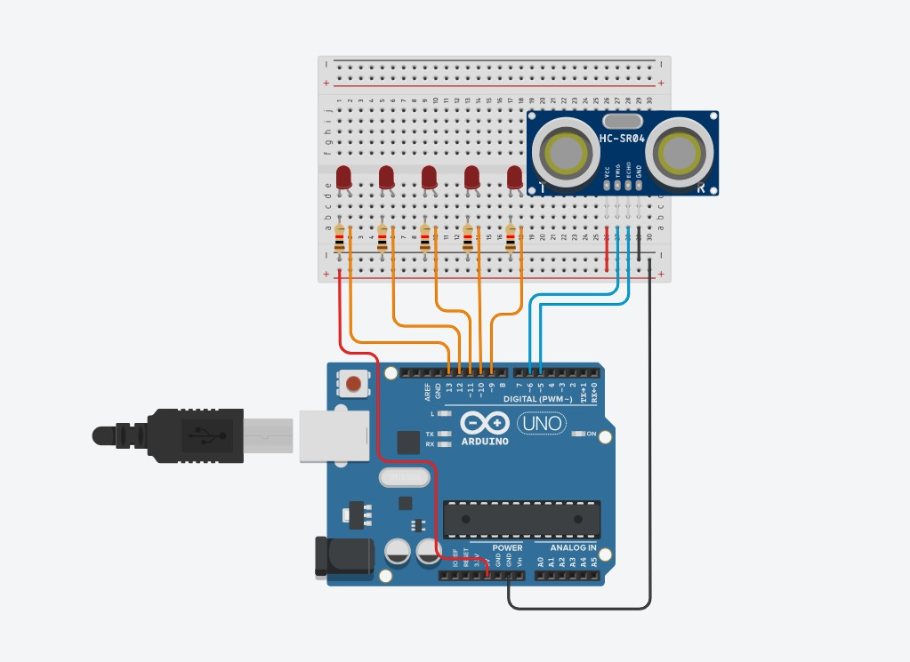

# Ultrasonic Distance Finder

To find the distance of an object from the device of interest using an ultrasonic sensor.

## Materials Required

| Item | Quantity |
| -------- | ------- |
| Ultrasonic Distance Sensor | 1 |
| Arduino Mega | 1 |
| Red LED | 5 |
| 220 Ω resistor | 5 |

Listed above are the materials and their quantity required.

Ensure that you have the aforementioned components before you start!

## Software Required

### Downloading the Arduino IDE
1.  Visit the Arduino Downloads Page: https://www.arduino.cc/en/software/
2. Download the version of the IDE appropriate for your system.

NOTE: If you’re using a package manager like apt, homebrew or choco, you can install it
via your package manager too.
### Setting up the Arduino IDE

1.  Open the IDE by clicking on it, and follow the instructions on screen.

## Circuit Diagram

We're going to connect five LED lights to our Raspberry Pi and make them light up and dance!

The diagram given below shows necessary circuit connections that one must do: 

1. Firstly, assemble the circuit by closely observing this diagram and recreating it:

    

    Keep a note of what GPIO pins each LED is connected to!
    > Q: Why do you think the LEDs need to have a resistor in series with them?

## Code And More

```cpp
int trig=6;
int echo=5;
int duration;
int distcm;
int led1=13;
int led2=12;
int led3=11;
int led4=10;
int led5=9;

void setup()
{
  pinMode(trig,OUTPUT);
  pinMode(led1,OUTPUT);
  pinMode(led2,OUTPUT);
  pinMode(led3,OUTPUT);
  pinMode(led4,OUTPUT);
  pinMode(led5,OUTPUT);
  pinMode(echo,INPUT);
}

void turnoff()
{
    digitalWrite(led1,LOW);
    digitalWrite(led2,LOW);
    digitalWrite(led3,LOW);
    digitalWrite(led4,LOW);
    digitalWrite(led5,LOW);
}

void loop()
{

    // your code goes here
    // good luck coding

}
```

## How Does an Ultrasonic Distance Sensor Work?

The Ultrasonic Sensor has 4 pins, VCC, GND, Trig and Echo.

VCC and GND are for Power and Ground respectively.

`Trig` and `Echo` are more specific.

If you're familiar with Sonar, the concepts are pretty similar.

`Trig` sends out a pulse of sound, and the reflected wave comes back on `Echo`.

By measuring the time between these pulses, we can determine how far away the nearest object is.

```
digitalWrite(trig,LOW);
delayMicroseconds(2);
digitalWrite(trig,HIGH);
delayMicroseconds(10);
digitalWrite(trig,LOW);
duration=pulseIn(echo,HIGH);
distcm=duration*0.034/2;
```