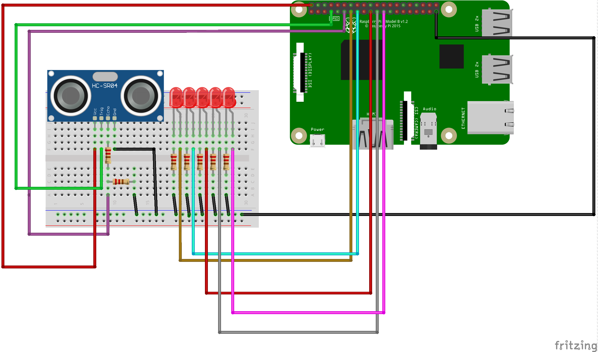

# A Raspberry Pi Based Ultrasonic Distance Sensor

This project will teach you the very fundamentals of programming the GPIO pins of the Raspberry Pi line of Single-Board-Computers by building a system that leverages Ultrasonic Sensors to detect the distance to the nearest object, and flash the appropriate number of LEDs.

## Hardware Required

| Item | Quantity |
| -------- | ------- |
| Working Raspberry Pi 1 B+/2/3/4 | 1 |
| Resistors (220 Ω) | 5 |
| Jumper Wires | Q.S |
| Generic LEDs| 5|
| BreadBoard 400| 1|

## Software Required

### On Own System
1. A VNC Client, such as [VNC Viewer](https://www.realvnc.com/en/connect/download/viewer/).

### On Raspberry Pi
1. Raspberry Pi OS
    1. Python3
    2. GPIOZero Python Library
    3. Flask

Before beginning, make sure you have all of the hardware and software needed!

## Phase 0 - Logging into the Raspberry Pi
The Raspberry Pi that comes as part of the experiment should already have the Raspberry Pi OS installed onto it.

1. Connect to the same network that the Raspberry Pi is connected to. This will vary from workshop to workshop.
2. The Raspberry Pi given to you will be marked with a number. The `hostname`, i.e, the name within the local network, of your Raspberry Pi is `buildclub<number>.local`.

    > For example. if your Pi was marked with the number `1`, the `hostname` would be `buildclub1.local`.

    Open your VNC Client and connect to your Raspberry Pi by entering the `hostname` where appropriate.
    > For VNC Viewer, the appropriate place is at the very top of the page, like so:
    
    On pressing `Enter`, the connection should be established.
    Be sure to read and understand any prompts that come up during and after this process!

3. You may be prompted to enter the username and password for your account on the Raspberry Pi. The default username and password we've set for you are `buildclub` and `buildclub` respectively:


You should now be connected to the Raspberry Pi. You should see a Desktop open like the one below:


## Phase 1 - Assembling the LEDs and lighting them up!

We're going to connect five LED lights to our Raspberry Pi and make them light up and dance!

1. Firstly, assemble the circuit by closely observing this diagram and recreating it:

    

    Keep a note of what GPIO pins each LED is connected to!

    > Q: Why do you think the LEDs need to have a resistor in series with them?
2. Once you've built your circuit, open a new file and name it `LEDs.py`. Inside the file, write the following code, and fill in the blank spaces as appropriate:

    ```py
    from gpiozero import LED
    LEDPIN1 = <insert the number of the GPIO pin that the first LED is connected to here>
    .
    .
    .
    LED1 = LED(LEDPIN1)
    .
    .
    .
    LED5 = LED(LEDPIN5)


    ```

    Now that the initialisation is all done, you can turn on a particular LED with `LEDx.on()` e.g `LED1.on()`!

    > How might you turn off a particular LED?

    To make an LED Blink, we have to turn it on, wait or sleep for a few seconds, and then turn it off.

    To wait, we use a function called `sleep` which we import from the `time` module like so, at the very top of the program:

    ```py
    from time import sleep
    from gpiozero import LED
    .
    .
    .
    ```

    To make the LED blink forever, we can use a `while-loop`:

    ```py
    .
    .
    .
    while True:
        <blinking code goes here>
    ```
    > You can make `python` wait for a second by calling the `sleep()` function with the parameter `1`!

    So now you should have a single LED, blinking constantly.

    > Try editing the code so that you can flash multiple LEDs in different patterns. Go crazy!

## Phase 2 - Reading Data from the Ultrasonic Distance Sensor

We're going to connect a `HC-SR04` Ultrasonic Distance sensor to our Raspberry Pi to read the distance of the nearest object to the `Pi`.

1. Firstly, assemble the circuit by closely observing this diagram and recreating it:

    

    Keep a note of what GPIO pins each pin of the sensor is connected to!

    IMPORTANT: DO NOT REVERSE THE VCC AND GND PINS! THIS WILL BREAK THE SENSOR OR THE RASPBERRY PI INDEFINITELY!

    > Q: Why do you think there needs to be a wierdly arranged system of resistors from which the value of `echo` is taken?

    > A/Q: ChatGPT, what are `Voltage Levels`, and what is `Level Shifting`? Why is it done?

2. After assembling the circuit, open another file called  `Ultra.py` and start with the following code:

    ```py
    from gpiozero import DistanceSensor
    from time import sleep

    sensor = DistanceSensor(
        echo=<Pin number of Pin Connected to Echo>,
        trigger=<Pin number of Pin Connected to trigger>
    )

    while True:
        print(sensor.distance)
        sleep(1)
    ```
    > Q: What unit do you think the sensor reading is in?
    > A/Q: When in doubt, read [the documentation](https://gpiozero.readthedocs.io/en/stable/api_input.html#gpiozero.DistanceSensor)!


## Phase 3 - Reading Data from the Ultrasonic Distance Sensor

So you've learned how to turn on (and off) LEDs and you've learned how to work with the `HC-SR04` Ultrasonic Distance Sensor.

Now, you're going to combine both skills and build a system that turns on more LEDs the closer you get to the sensor.

While we expect you to be able to do this part pretty much on your own, feel free to reach out to us to ask for help.
<details>
  <summary>Spoiler - Circuit Diagram</summary>
   
</details>

## Food For Thought

Your workshop session might have other teams that built a similar project using an `Arduino` or a `Dexter` board instead.

How was your program different from theirs?