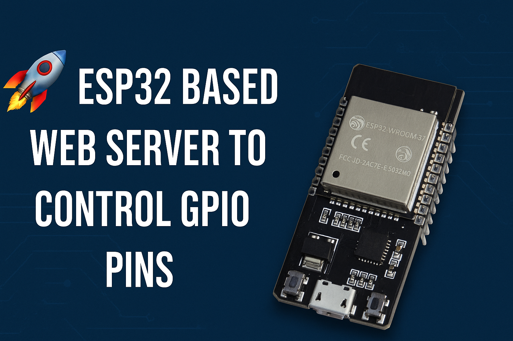
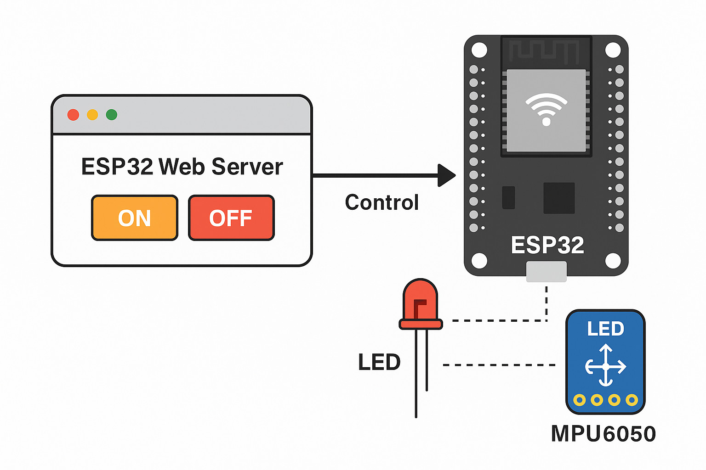
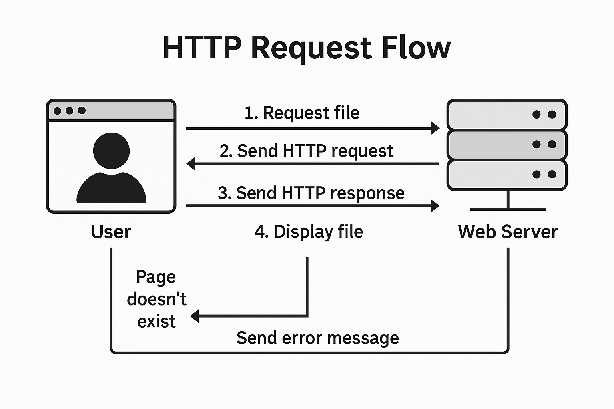
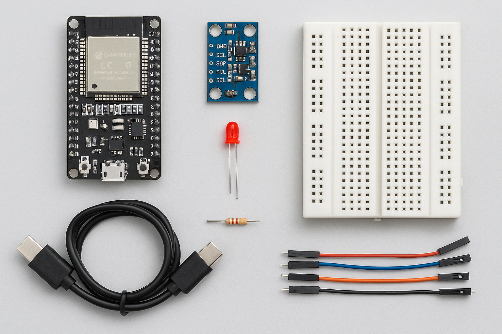
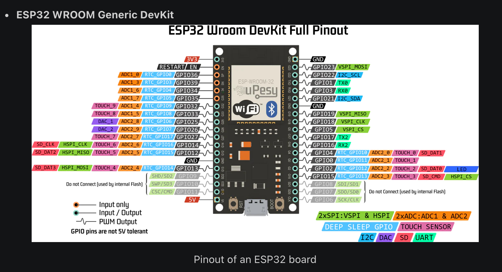
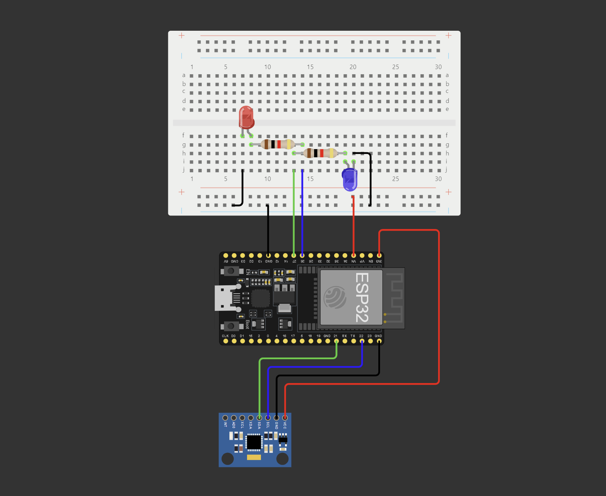

# 🚀 ESP32 Based Web Server to Control GPIO Pins

 

---

## 🎉 Welcome to The Build Club Workshop!

Hey everyone!  
If you’re reading this on the afternoon of **15th April 2024**, then good news:  
Your most awaited student tech club, **The Build Club**, is back with workshops!  
**LESSGGGOOO!** 🙌

> _Do me a favour: give each other high fives! If possible, try giving them to Prez Alamelu and Secretary Aathish if they are around._ 🤗

Usually, you’d see me in person, but I took too many ODs, so gotta attend classes man 😅

---

## 📱 Contact

If you need help, contact me via WhatsApp:  
```
+91 99411 22299
```
_I’ll try to get to you amid my EMF and Microcontrollers lectures. (Please don’t prank call or register my number on sketchy websites!)_

---

## 📝 Table of Contents

- [🚀 ESP32 Based Web Server to Control GPIO Pins](#-esp32-based-web-server-to-control-gpio-pins)
  - [🎉 Welcome to The Build Club Workshop!](#-welcome-to-the-build-club-workshop)
  - [📱 Contact](#-contact)
  - [📝 Table of Contents](#-table-of-contents)
  - [🌐 Overview](#-overview)
  - [🌍 What is a Web Server?](#-what-is-a-web-server)
  - [⚙️ How Do They Work?](#️-how-do-they-work)
  - [🛠️ Hardware Requirements](#️-hardware-requirements)
  - [📶 Wi-Fi Development Board Pinouts](#-wi-fi-development-board-pinouts)
    - [1. ESP32 Development Board](#1-esp32-development-board)
    - [2. ESP8266 Development Board](#2-esp8266-development-board)
  - [🧩 Which GPIO Pins Should We Use?](#-which-gpio-pins-should-we-use)
  - [💻 Software Requirements](#-software-requirements)
    - [Downloads and Installations](#downloads-and-installations)
  - [🧑‍🔧 Phase 1 - Circuit Assembly](#-phase-1---circuit-assembly)
  - [💻 Phase 2 - Coding in Arduino IDE](#-phase-2---coding-in-arduino-ide)
  - [🧪 Phase 3 - Testing and Tinkering](#-phase-3---testing-and-tinkering)
  - [🌟 Inspiration \& Next Steps](#-inspiration--next-steps)
  - [🙏 Acknowledgements](#-acknowledgements)

---

## 🌐 Overview

In this workshop, we’ll explore the world of web servers and web hosting by **locally hosting our own web dashboard** to control the GPIO pins (input/output pins) of our **ESP32-WROOM-32 Devkit** board.

We’ll assemble a simple circuit with:
- An **LED**
- An **MPU6050 sensor** (to read breadboard orientation)

 <!-- Add a diagram showing the ESP32, LED, and MPU6050 -->

> **If it’s past 2pm, skip to the [Software Requirements](#software-requirements) section!**

---

## 🌍 What is a Web Server?

A **web server** is a combination of software and hardware that uses HTTP (Hypertext Transfer Protocol) and other protocols to respond to client requests made over the World Wide Web.

- **Primary function:** Display website content by storing, processing, and delivering web pages.
- **Protocols supported:** HTTP, SMTP (email), FTP (file transfer).

 <!-- Add a diagram showing client-server interaction -->

---

## ⚙️ How Do They Work?

Web server software enables users to access websites through their domain names and delivers the website’s content to the requesting user.

**Process:**
1. User requests a file via browser (e.g., Chrome, Firefox).
2. Browser sends an HTTP request to the server.
3. Server locates the content and sends it back via HTTP.
4. If the page doesn’t exist, an error message is sent.

 

> Check out this [video explanation](https://youtu.be/9J1nJOivdyw?si=uA2mfJwd8ia0Um7e) for more!

---

## 🛠️ Hardware Requirements

| Item                  | Quantity |
|-----------------------|----------|
| ESP32 Wi-Fi board     | 1        |
| MPU 6050              | 1        |
| Resistor (1k Ω)       | 1        |
| LED                   | 1        |
| Data cable            | 1        |
| Breadboard 400        | 1        |
| Jumper wires          | Q.S      |

 <!-- Add a photo or illustration of all components -->

---

## 📶 Wi-Fi Development Board Pinouts

Here are some commonly used Wi-Fi development boards and their pinouts:

### 1. ESP32 Development Board



### 2. ESP8266 Development Board


---

## 🧩 Which GPIO Pins Should We Use?

The ESP32 chip has **48 pins** with various functions.  
Not all pins are accessible or usable on all boards.  
Some pins have special functions or should not be used.

> Even though the pins are pre-selected for this project, it’s important to know about [these pins](https://randomnerdtutorials.com/esp32-pinout-reference-gpios/).

---

## 💻 Software Requirements

### Downloads and Installations

1. **[Arduino IDE](https://www.arduino.cc/en/software)**  
   _Download all necessary drivers prompted during installation._

2. **Install ESP32 Board Drivers:**
    - Copy this URL:
      ```
      https://dl.espressif.com/dl/package_esp32_index.json
      ```
    - Arduino IDE:  
      `File > Preferences > Additional boards manager URLs`  
      Paste the URL and click 'Ok'.
    - `Tools > Board > Boards Manager`  
      Search for **esp32** and install by Espressif Systems.

3. **Install WiFi Library:**
    - Visit [WiFi Library](https://www.arduino.cc/reference/en/libraries/wifi/)
    - Download version 1.2.7 as ZIP.
    - Arduino IDE:  
      `Sketch > Include Library > Add .ZIP Library`  
      Select the downloaded ZIP.

4. **Install MPU 6050 Library:**
    - Arduino IDE:  
      `Sketch > Include Library > Manage libraries`
    - Search for **adafruit mpu6050** and install.
    - Also install **Adafruit Unified Sensor** and **Adafruit Bus IO**.

---

## 🧑‍🔧 Phase 1 - Circuit Assembly

Now that you have all the hardware and software ready, let’s assemble the circuit!



> **Double check the pin connections!**  
> The ESP32 devkit shown may differ from yours. Pin numbers are the same, but prefixes may vary ("G" vs "D").

---

## 💻 Phase 2 - Coding in Arduino IDE

Open the well-documented [Esp32Webserver](./Esp32Webservewr.ino) Arduino file in this repository.

- Code along with your peers!
- Ask questions if you’re stuck.
- If you’re new to Arduino IDE, ask instructors for help during compilation and execution.

---

## 🧪 Phase 3 - Testing and Tinkering

If you followed the instructions and had some luck, you should be proud of your creation!  
If not, don’t worry — we’re here to help.

> **Tip:**  
> Experiment with different GPIO pins, sensors, or web dashboard designs for extra fun!

---

## 🌟 Inspiration & Next Steps

- Explore more microcontroller projects.
- Refer to Arduino documentation and the active online community for help.
- Try adding more sensors or controlling multiple devices from your web dashboard.

---

## 🙏 Acknowledgements

- [ESP32 Web Server with Bootstrap](https://www.hackster.io/onedeadmatch/esp32-web-server-with-bootstrap-b80105)
- [Random Nerd Tutorials](https://randomnerdtutorials.com/)
- [Random Nerd Tutorials MPU 6050](https://randomnerdtutorials.com/esp32-mpu-6050-accelerometer-gyroscope-arduino/)
- [What Is?](https://www.techtarget.com/whatis/definition/Web-server)

---

> _Stay creative and see you next time!_ 🚀

