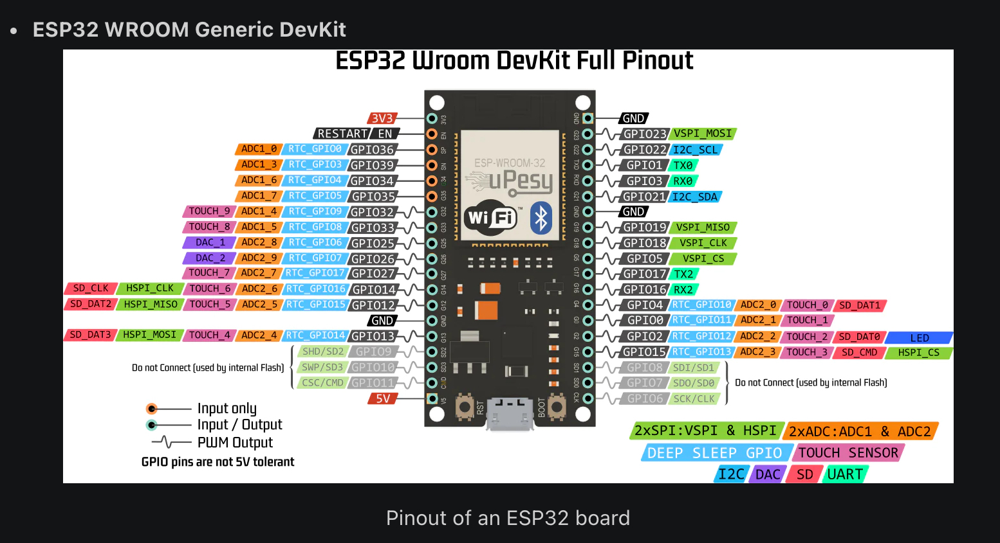
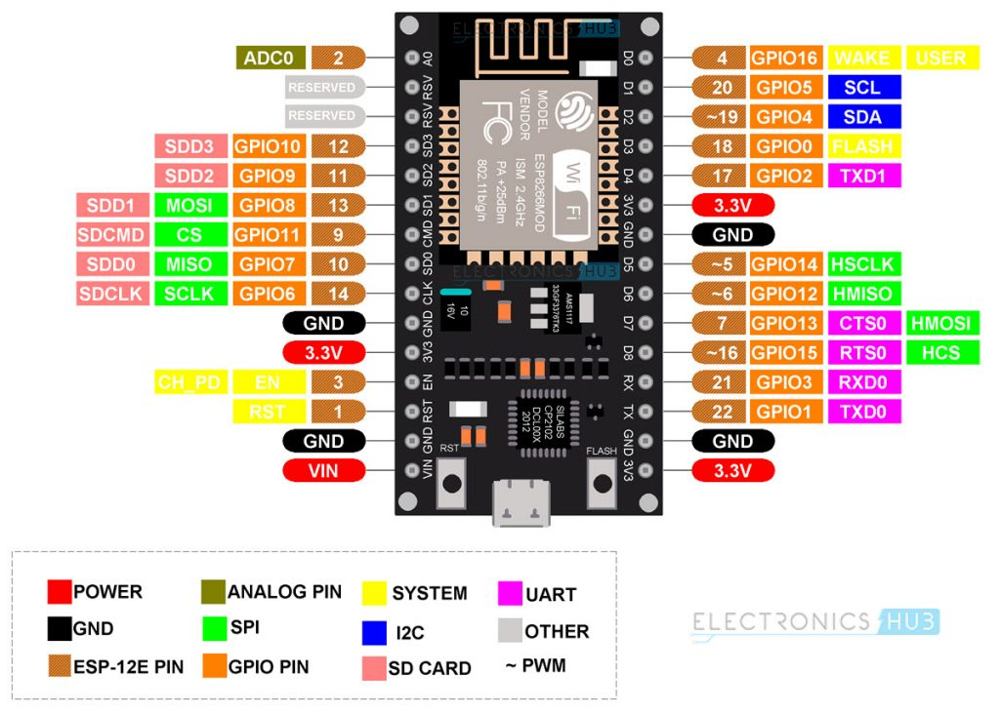
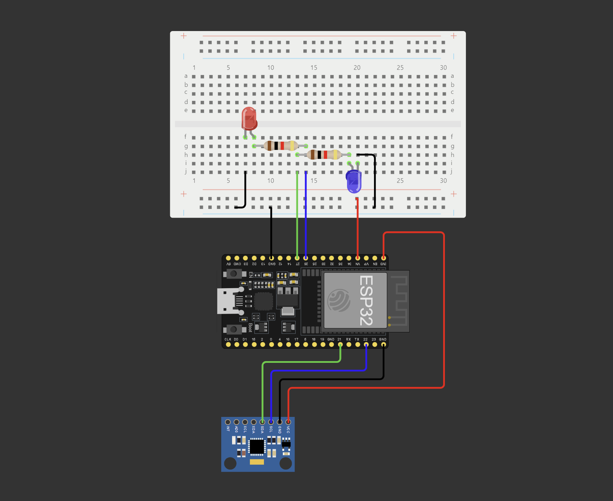

# ESP32 Based Web Server to Control GPIO pins

Hey everyone, if you are reading this on the afternoon of 15th of April 2024 then good news, your most awaited student tech club, The Build Club, is having its workshops again! Yay! LESSGGGOOO (Do me a favour give each other high fives, if possible try giving them to Prez Alamelu and Secretary Aathish if they are available).

Usually you guys can expect my physical presence in workshops but because I took too many ODs, gotta attend classes man :'(

Nevertheless do contact me via my WhatsApp number,
```
+91 99411 22299
```
I shall try to get to you guys amid my EMF and Microcontrollers lectures. (Pls don't prank call or register my number in random sketchy websites).


## Overview

In our ESP32 project series this workshop we are to explore the world of web servers and web hosting by locally hosting our own web dashboard to control the GPIO pins, aka input/output pins of our ESP32-WROOM-32 Devkit board. We will then put together a simple circuit consisting of an LED and a MPU6050 sensor to read the orientation of the breadboard.
Now let's get started!

Please skip to this [section](#software-requirements) if it's past 2pm already.


## What is a Web Server?

A web server is a combination of software and hardware that uses HTTP (Hypertext Transfer Protocol) and other protocols to respond to client requests made over the World Wide Web. The primary function of a web server is to display website content. It accomplishes this by storing, processing, and delivering web pages to users. Apart from HTTP, web servers also support protocols such as SMTP (Simple Mail Transfer Protocol) and FTP (File Transfer Protocol) which are used for email, file transfer, and storage.

Web server hardware is connected to the internet and facilitates the exchange of data with other connected devices. On the other hand, web server software regulates how a user can access hosted files. The web server process is a prime example of the client/server model. It is imperative that all computers hosting websites have web server software installed on them.

## How do they work?

Web server software is what enables users to access websites through their domain names and delivers the website's content to the requesting user. The software component consists of several parts, including at least an HTTP server. The HTTP server has the ability to interpret HTTP and URLs. As for the hardware component, a web server is essentially a computer that stores all the necessary web server software and other files related to the website such as HTML documents, images, and JavaScript files.

When a user requests a file hosted on a web server through a web browser such as Google Chrome or Firefox, the browser sends an HTTP request to the server. Upon receiving the request, the HTTP server accepts it, locates the required content, and transmits it back to the browser through HTTP.

When a person types a website address in their web browser's address bar, the browser needs to find the website on the internet. This is done by translating the website's name to an IP address through DNS (Domain Name System) or by checking its cache. Once the browser gets the IP address, it connects to the web server hosting the website. The browser then sends a request to the web server for the specific webpage or file that the person wants to view. The web server then responds with the requested page through HTTP. If the requested page does not exist or there's an error, the web server will send an error message to the browser. The browser will then display the webpage if everything is correct.

Check [this](https://youtu.be/9J1nJOivdyw?si=uA2mfJwd8ia0Um7e) video out to know more.


## Hardware Requirements

| Item | Quantity |
|--------|--------|
| Esp32 Wi-Fi board | 1 |
| MPU 6050 | 1 |
| Resistor (1k Ω) | 1 |
| LED | 1 |
| Data cable | 1 |
| Breadboard 400 | 1 |
| Jumper wires | Q.S |


## Wi-Fi Development Board Pinouts

Here are some commonly used Wi-Fi development boards and their pinouts.

1. ESP32 Development Board

    

2. ESP8266 Development Board

    


## Which GPIO Pins Should We Use?

The ESP32 chip is equipped with 48 pins that have various functions. However, not all pins are accessible in all ESP32 development boards, and some pins cannot be utilized. There are certain pins with specific functions and certain pins that shouldn't be touched at all. Even tho the pins have been aptly selected for you guys in this project, it is still important that you guys are aware of [these pins](https://randomnerdtutorials.com/esp32-pinout-reference-gpios/).


## Software Requirements

### Downloads and Installations

1. [Arduino IDE](https://www.arduino.cc/en/software) - download all the necessary drivers prompted along the IDE installation.

2. Follow the steps below to install the drivers for Esp32:

   
    ```
    https://dl.espressif.com/dl/package_esp32_index.json

    ```
    
    1. Copy the above path.
    2. Open your Arduino IDE.
    3. File > Preferences > Additional boards manager URLs.
    4. Paste the above path and click 'Ok'.
    5. Tools > Board > Boards Manager.
    6. Search for esp32 and install esp32 by Espressif Systems.

3. Follow the steps below to install the WiFi library required for todays session:

    1. Visit the official documentation page of the [WiFi](https://www.arduino.cc/reference/en/libraries/wifi/) library.
    2. Click on the latest version 1.2.7 and download the zip file.
    3. Open your Arduino IDE.
    4. Sketch > Include Library > Add .ZIP Library.
    5. Browse for the zip file you just downloaded.
    6. You shall see a confirmation message on the arduino terminal once the library has been installed successfully.

4. Follow the steps below to install the MPU 6050 library required for todays session:

    1. Open your Arduino IDE.
    2. Sketch > Include Library > Manage libraries
    3. Type “adafruit mpu6050” on the search box and install the library.
    4. You shall see a confirmation message on the arduino 
terminal once the library has been installed successfully
    5. Then, search for “Adafruit Unified Sensor”. Scroll all the way down to find the library and install it.
    6. Finally, search for “Adafruit Bus IO” and install it.


## Phase 1 - Circuit Assembly.

Now that we have procured all the hardware required and installed the required software, drivers and libraries, let's get started with the circuit assembly!



> Double check the pin connections, the esp32 devkit shown in the picture may slightly differ from the actual one you received, please be vary of that and connect accordingly. The pin numbers are the same in your version too, Only difference is in prefix "G" instead of the regular "D".

## Phase 2 - Coding in Arduino IDE.

Open the well documented [Esp32Webserver](./Esp32Webserver.ino) arduino file available in the same repository. Have a fun code along session with your peers, shoot out any questions you may have to ask, even if the instructor doesn't know he would get back to you shortly. If you are new to using the Arduino IDE do ask around the instructors for help during compilation and execution of the code. Don't hesitate to text me if you come across any hiccups.

## Phase 3 - Testing and Tinkering.

If you have followed the instructions exactly as instructed and have had some luck then you should be proud and delighted of what you just created. Nevertheless even if you failed to get the required  results, Don't worry we are here to help you out.

Hope you had a great time and maybe got inspired to make something of your own. I feel that now you are ready to delve into the world of microcontrollers and explore similar projects on your own. Refer to the online documentation for arduino and get help from the active online community when you hit dead-ends.

Until then stay creative and I will see you next time.

## Acknowledgements

 - [ESP32 Web Server with Bootstrap](https://www.hackster.io/onedeadmatch/esp32-web-server-with-bootstrap-b80105)
 - [Random Nerd Tutorials](https://randomnerdtutorials.com/)
 - [Random Nerd Tutorials MPU 6050](https://randomnerdtutorials.com/esp32-mpu-6050-accelerometer-gyroscope-arduino/)
 - [What Is?](https://www.techtarget.com/whatis/definition/Web-server)

